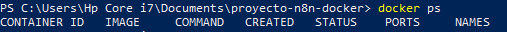
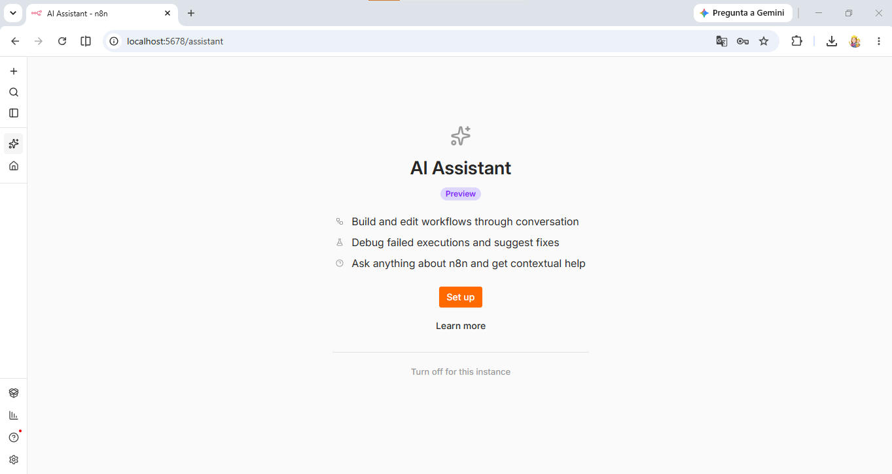
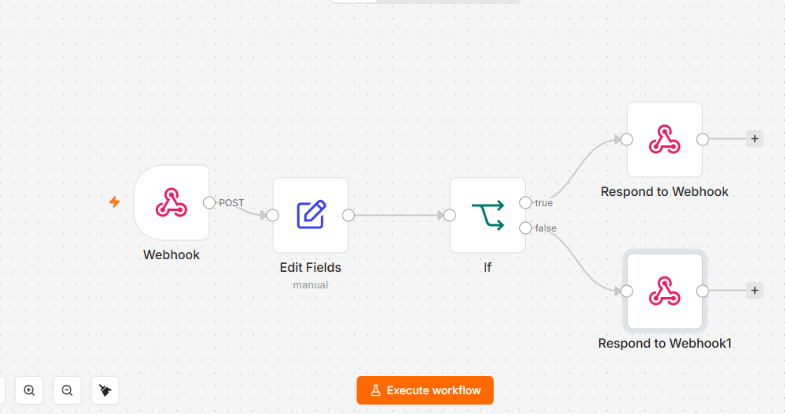
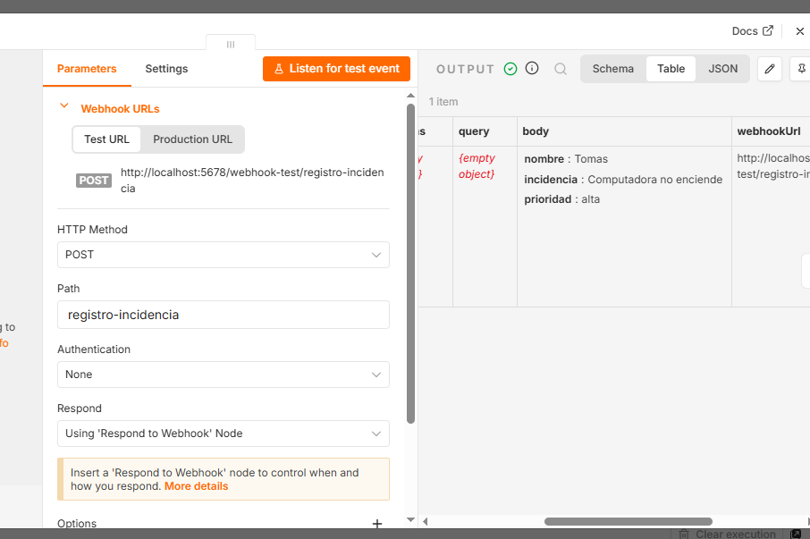
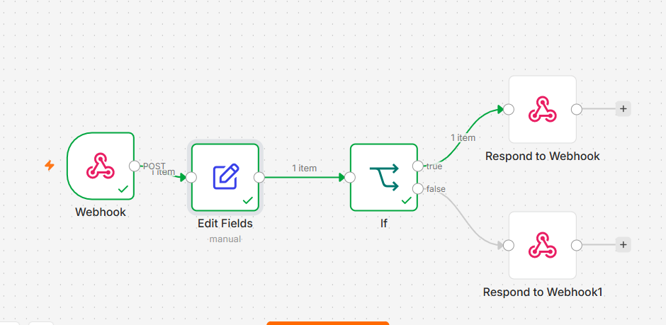
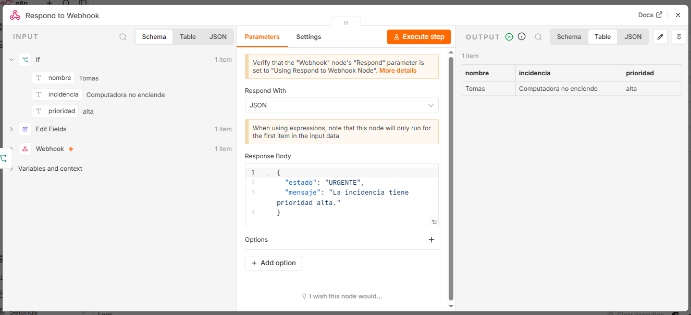
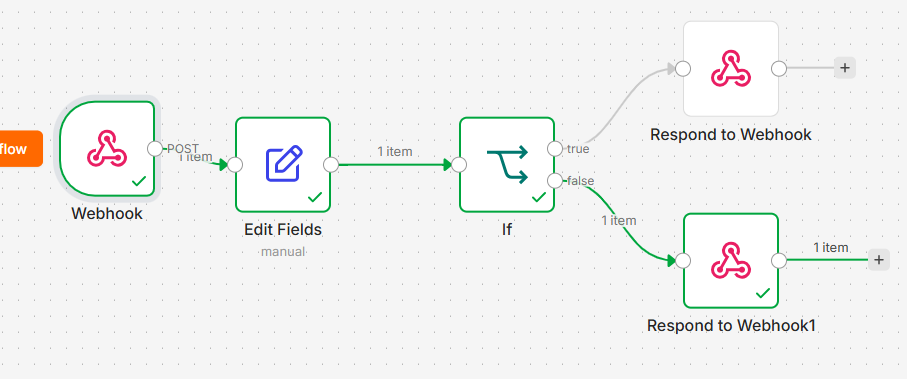
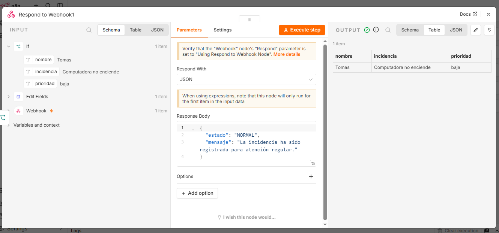
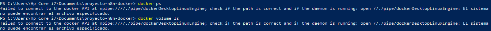
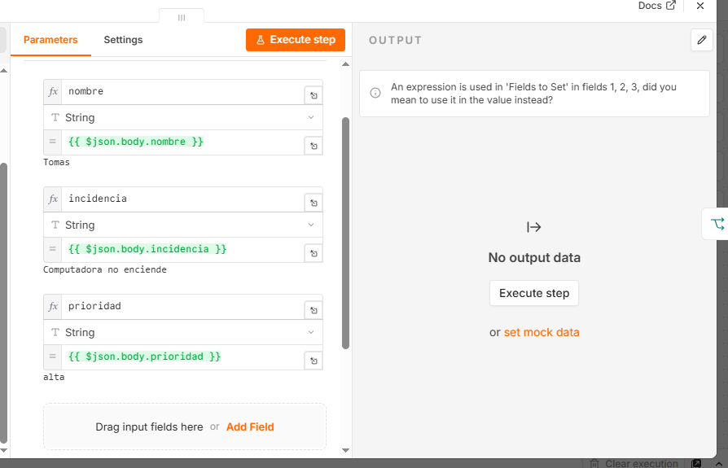

# Automatizacion de registro y clasificacion de incidencias con n8n, Docker y GitHub

## Descripcion
Este proyecto implementa un workflow de automatizacion desarrollado en n8n, desplegado localmente mediante Docker Compose, que permite registrar y clasificar incidencias segun su nivel de prioridad.

## Tecnologias utilizadas
- Docker
- Docker Compose
- n8n
- Git
- GitHub
- PowerShell

## Despliegue del proyecto

Para levantar el proyecto localmente:

```powershell
docker compose up -d
```

Verificar que el contenedor este corriendo:

```powershell
docker ps
```

Acceder a n8n desde el navegador: http://localhost:5678

## Estructura del proyecto

```
proyecto-n8n-docker/
├── docker-compose.yml
├── .gitignore
├── README.md
├── evidencias/
└── workflows/
    └── registro-incidencias.json
```

## Funcionamiento del workflow

Webhook
|
Edit Fields
|
IF
/
TRUE FALSE
| |
URGENTE NORMAL

El webhook recibe los datos de la incidencia, el nodo Edit Fields normaliza la informacion recibida, y el nodo IF evalua la prioridad: si es alta, el flujo toma la rama TRUE y clasifica la incidencia como URGENTE; si es baja, toma la rama FALSE y la clasifica como NORMAL.


## Evidencias

### Docker ejecutandose correctamente


### n8n funcionando en localhost:5678


### Workflow completo


### Webhook recibiendo los datos


### Prueba con prioridad alta
Se envio una solicitud con el campo de prioridad configurado como "alta". El nodo IF evaluo la condicion y tomo la rama TRUE, devolviendo el estado URGENTE.




### Prueba con prioridad baja
Se envio una solicitud con el campo de prioridad configurado como "baja". El nodo IF evaluo la condicion y tomo la rama FALSE, devolviendo el estado NORMAL.




## Como probar el workflow manualmente

Para probar el webhook manualmente se envio una peticion POST a la URL generada por n8n
(http://localhost:5678/webhook/registro-incidencias) incluyendo un campo "prioridad" con el valor "alta" o "baja"
en el cuerpo de la solicitud en formato JSON. La respuesta del workflow confirmo la clasificacion
correcta (URGENTE o NORMAL) segun el valor enviado.

## Como probar el webhook desde PowerShell

Ademas de la prueba manual descrita anteriormente, el webhook tambien se puede probar directamente
desde PowerShell usando el comando Invoke-RestMethod.

### Prueba con prioridad alta

```powershell
Invoke-RestMethod -Uri "http://localhost:5678/webhook/registro-incidencias" -Method POST -Body (@{prioridad="alta"} | ConvertTo-Json) -ContentType "application/json"
```

Esta prueba envia una incidencia con prioridad alta. El nodo IF evalua la condicion, toma la rama
TRUE, y la respuesta del workflow devuelve el estado URGENTE.

### Prueba con prioridad baja

```powershell
Invoke-RestMethod -Uri "http://localhost:5678/webhook/registro-incidencias" -Method POST -Body (@{prioridad="baja"} | ConvertTo-Json) -ContentType "application/json"
```

Esta prueba envia una incidencia con prioridad baja. El nodo IF evalua la condicion, toma la rama
FALSE, y la respuesta del workflow devuelve el estado NORMAL.

## Matriz de incidencias tecnicas

Durante el desarrollo del proyecto se presentaron los siguientes inconvenientes:

| Error | Causa | Solucion |
|-------|-------|----------|
| Docker no lograba conectarse con el daemon al ejecutar comandos | Docker Desktop no se encontraba en ejecucion en el equipo | Se inicio Docker Desktop manualmente y se verifico nuevamente con el comando docker ps |
| n8n mostraba el error "An expression is used in Fields to Set" en varios campos del nodo Edit Fields | Las expresiones se habian configurado en el selector general del nodo en lugar de configurarse unicamente en el valor de cada campo | Se cambio el selector general a Fixed y se aplico la opcion Expression solo en el campo Value de cada uno de los valores necesarios |




## Resultado final

El workflow fue probado localmente de forma completa. Ambas rutas de decision del nodo IF funcionaron correctamente: la ruta TRUE clasifico las incidencias de prioridad alta como URGENTE, y la ruta FALSE clasifico las de prioridad baja como NORMAL, confirmando que la logica de clasificacion automatica opera segun lo esperado.
